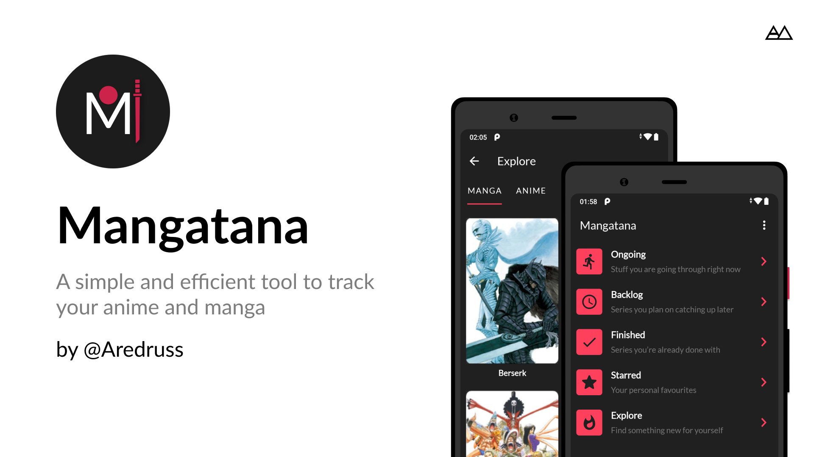

# Mangatana :shinto_shrine:
A simple Anime and Manga tracking app built with modern Android Components using MVVM Architecture 

### Try it out 	:secret:
Grab the latest version from [here](https://github.com/Aredruss/Mangatana/releases)

### Built With :toolbox:
- [Kotlin](https://kotlinlang.org/) - First class and official programming language for Android development.
- [Kotlin Coroutines](https://kotlinlang.org/docs/reference/coroutines-overview.html) - Lightweight solution for implementing asynchronous code
- [Koin](https://insert-koin.io/) - A smart Kotlin dependency injection library
- [Android Architecture Components](https://developer.android.com/topic/libraries/architecture) - Collection of libraries that help you design robust, testable, and maintainable apps.
  - [Flow](https://kotlinlang.org/docs/reference/coroutines/flow.html) - A flow is an asynchronous version of a Sequence, a type of collection values of which are lazily produced.
  - [ViewModel](https://developer.android.com/topic/libraries/architecture/viewmodel) - Stores UI-related data that isn't destroyed on UI changes. 
  - [Room](https://developer.android.com/topic/libraries/architecture/room) - SQLite object mapping library.
  - [Datastore](https://developer.android.com/topic/libraries/architecture/datastore) - A data storage solution that allows you to store key-value pairs or typed objects with protocol buffers
- [Material Components for Android](https://github.com/material-components/material-components-android) - Modular and customizable Material Design UI components for Android.
- [Modo](https://github.com/terrakok/Modo) - Modo is an open-source navigation library based on UDF principles for developing Single Activity applications.
- [Figma](https://figma.com/) - Figma is a vector graphics editor and prototyping tool which is primarily web-based.
- [Jikan API](https://jikan.docs.apiary.io/) - An Unofficial MyAnimeList API

### License :open_book:
```
    Apache 2.0 License


    Copyright 2021 Alexander Medyanik

    Licensed under the Apache License, Version 2.0 (the "License");
    you may not use this file except in compliance with the License.
    You may obtain a copy of the License at

       http://www.apache.org/licenses/LICENSE-2.0

    Unless required by applicable law or agreed to in writing, software
    distributed under the License is distributed on an "AS IS" BASIS,
    WITHOUT WARRANTIES OR CONDITIONS OF ANY KIND, either express or implied.
    See the License for the specific language governing permissions and
    limitations under the License.

```
